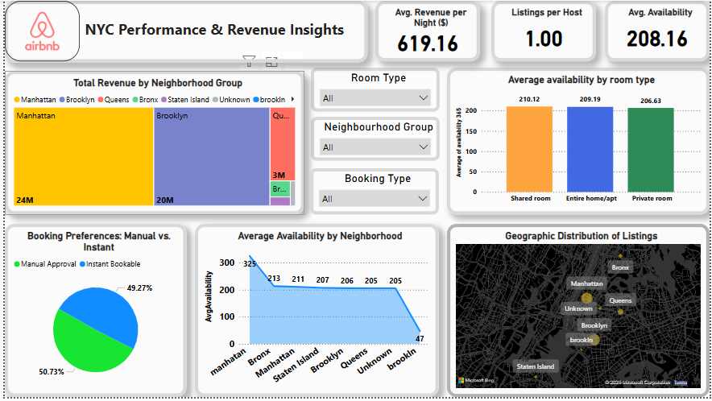
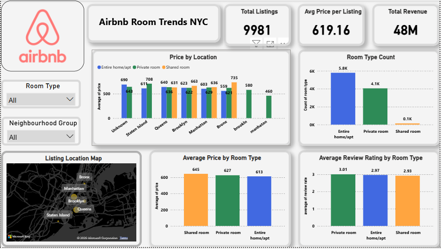

# Airbnb_Case_study_data_analysis

# 🏙️ NYC Airbnb Data Analysis Dashboard

This repository contains an interactive Power BI analysis project based on a case study involving Airbnb listings in New York City. The goal was to explore performance insights across various dimensions such as pricing, room types, review behavior, host engagement, and availability patterns.

## 📁 Project Case Study Overview

**Case Focus Areas:**
- Identify underperforming locations or listing types based on price, rating, and reviews.
- Predict listing churn or guest dissatisfaction using review and availability patterns.
- Recommend platform improvements for better host and guest engagement.
- Suggest pricing, marketing, or product strategies to increase profitability.

**Deliverables:**
- An interactive dashboard with multiple filters and slicers.
- Visual insights into listing performance across regions, room types, and host behavior.

---

## 📊 Dashboard 1: NYC Performance & Revenue Insights

### Key Components:
- **KPIs:** Avg Revenue Per Night, Listings Per Host, Occupancy Rate.
- **Treemap:** Revenue contribution by Neighbourhood Group.
- **Bar Chart:** Availability by Room Type.
- **Pie Chart:** Booking Status (Manual vs. Instant Bookable).
- **Map Visual:** Geographical distribution of listings.
- **Line Chart:** Availability trend by neighborhood group.

---

## 📊 Dashboard 2: Airbnb Room Trends NYC

### Key Components:
- **KPIs:** Total Listings, Average Price per Listing, Total Revenue.
- **Bar Charts:** Price and Room Type distribution by neighborhood and type.
- **Map Visual:** Neighborhood map focus.
- **Line Chart:** Distribution by construction year.

---

## 🛠️ Tools Used

- Power BI
- DAX for custom measures and categorization
- Microsoft Excel (Data Preprocessing)

---

## 📁 Files Included

- `NYC_Airbnb_Report.pbix` – Power BI file with dashboards.
- `airbnb_data.csv` – Cleaned Airbnb listing data.
- `Case_Study_Prompt.docx` – The original case study questions and objectives.
- `README.md` – Project overview and visuals.

---

## 🔍 Insights Summary

- Manhattan contributes the highest revenue but also shows a skewed listing distribution.
- Private rooms dominate listing count but show lower availability.
- Instant Bookable listings are slightly less than Manual Approval ones.
- Older properties (by construction year) do not necessarily align with better availability or ratings.

---

## 📌 How to Use

1. Clone the repo
2. Open the `.pbix` file in Power BI Desktop
3. Explore using slicers (room type, neighborhood, booking status)

---

## 📧 Contact

For any queries or feedback, feel free to connect via GitHub issues.

---

